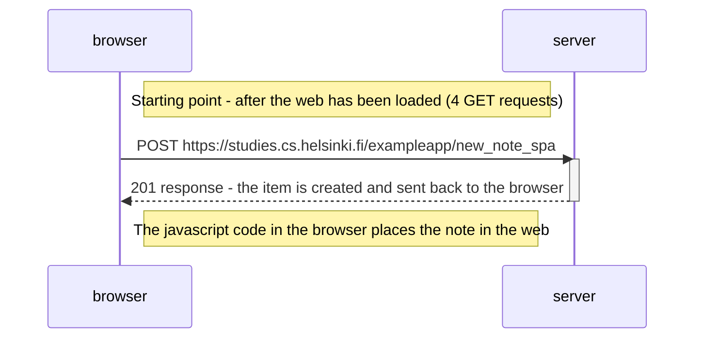

```mermaid
sequenceDiagram
    participant browser
    participant server

    Note right of browser: Starting point - after the web has been loaded (4 GET requests)
    browser->>server: POST https://studies.cs.helsinki.fi/exampleapp/new_note_spa
    activate server
    server-->>browser: 201 response - the item is created and sent back to the browser
    deactivate server
    Note right of browser: The javascript code in the browser places the note in the web
```
